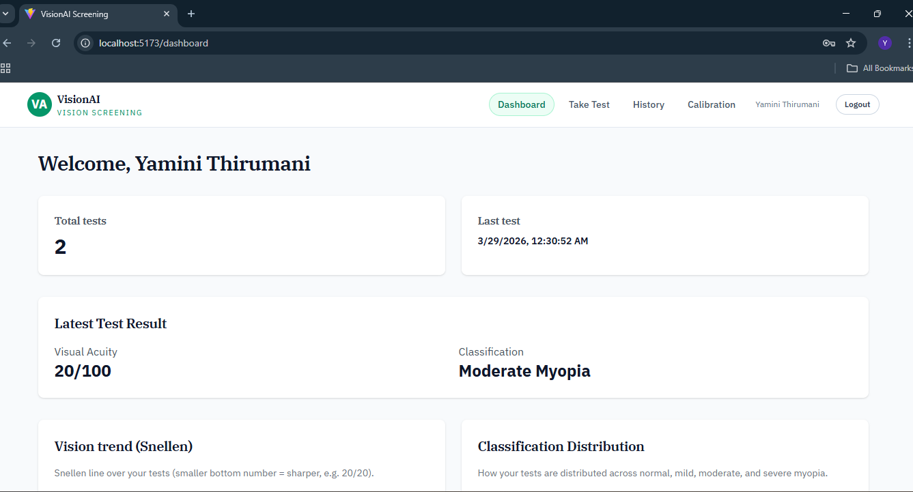
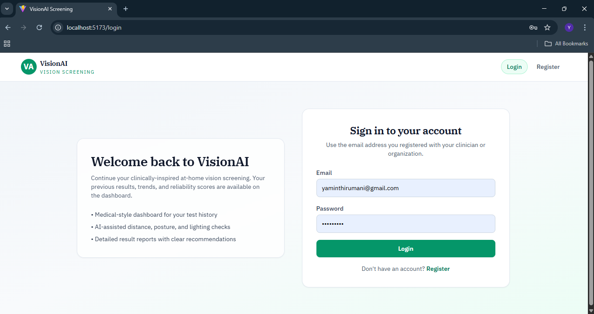
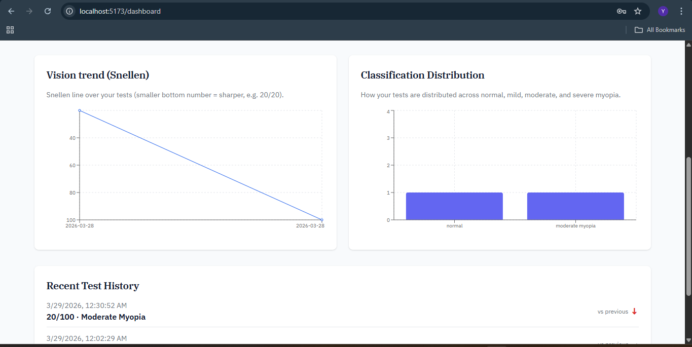
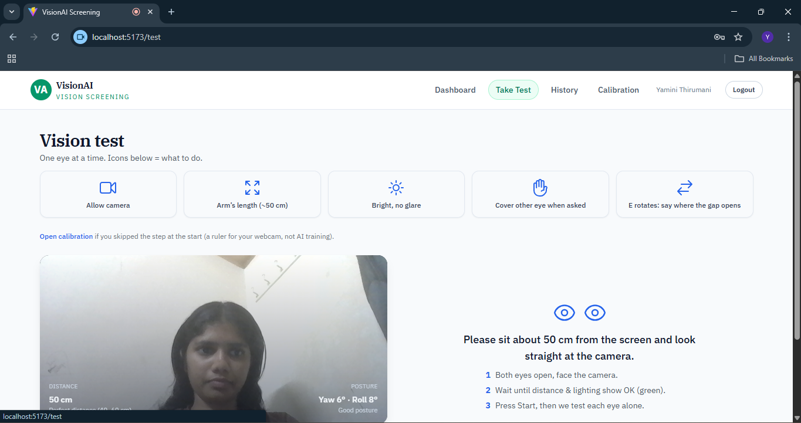
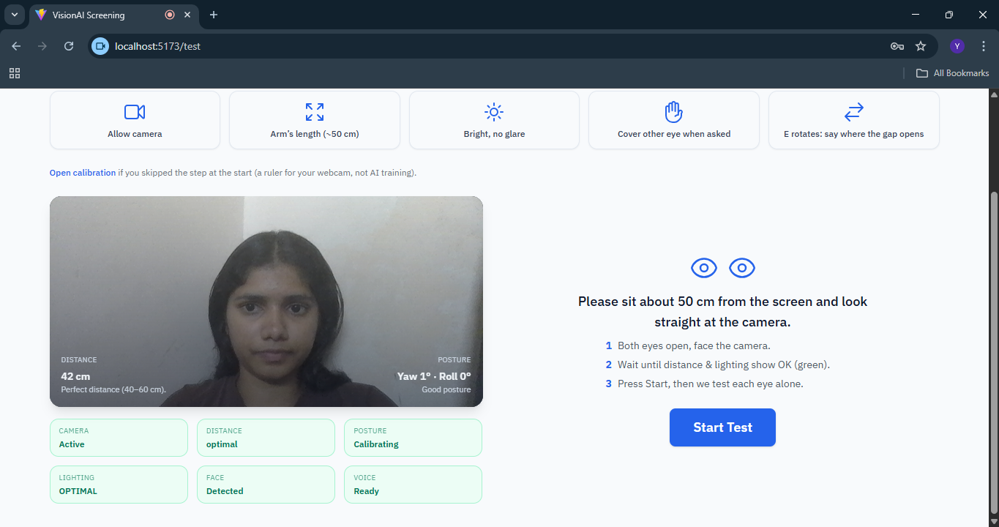
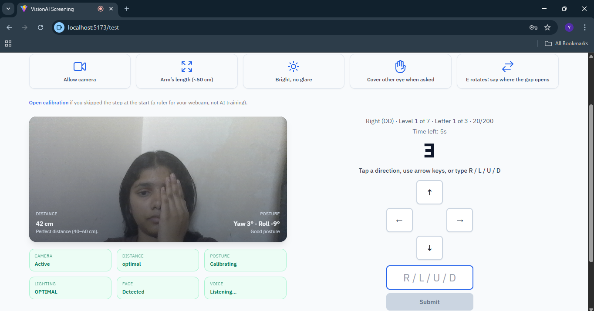
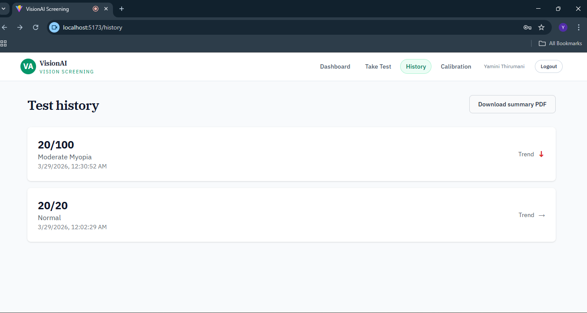
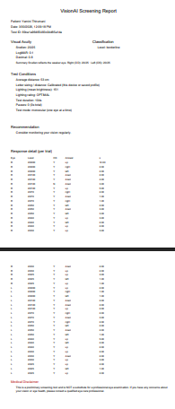
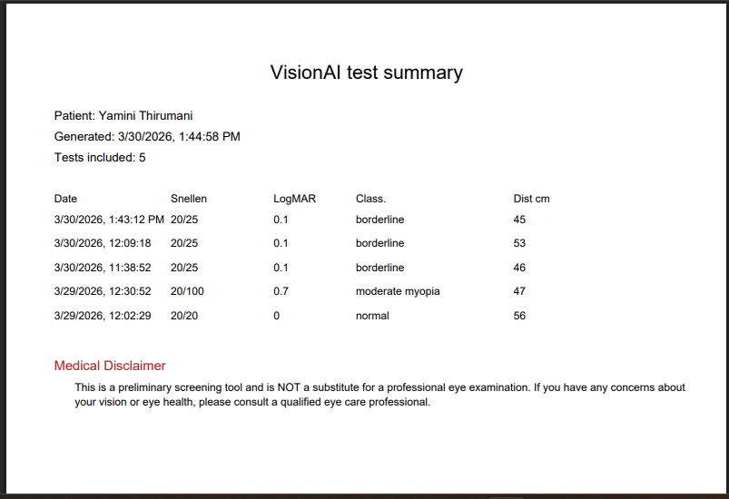

# VisionAI - AI-Driven Self-Calibrating Vision Screening

> A browser-based, AI-assisted preliminary vision screening application using your webcam — no special hardware required.



---

## 🔴 Live Demo

> 🎥 **[Watch Demo Video](#)** — *(add your demo video link here)*

---

## 📌 About the Project

**VisionAI** is a self-administered vision screening web application built as a Mini Project for the Department of CSE (Data Science), G. Narayanamma Institute of Technology & Science (GNITS), Hyderabad.

It uses **MediaPipe FaceMesh** to detect 468 facial landmarks in real time, estimate the user's distance from the screen, monitor posture, and administer a **Tumbling E chart** vision test — all directly in the browser without any backend ML processing.

Results are stored securely and users can track their vision trends over time through a medical-style dashboard.

---

## 🎯 Key Features

- 📷 **Real-time face detection** using MediaPipe FaceMesh
- 📏 **Auto distance estimation** using inter-pupillary distance (IPD) and calibration
- 🧍 **Posture monitoring** — yaw, pitch, roll detection
- 💡 **Lighting analysis** from live webcam feed
- 👓 **Glasses detection** with user warning
- 🔤 **Tumbling E chart** — arrow keys, D-pad, voice, or typed input
- 🧠 **Per-level scoring** with Snellen, logMAR, and decimal acuity
- 📊 **Confidence score** based on consistency, response time, and conditions
- 📈 **Dashboard** with vision trend charts and classification history
- 📄 **PDF report** generation with full test breakdown
- 🔐 **JWT-based authentication** with protected routes

---

## 🖥️ Screenshots

### Login Page


### Dashboard — Test Summary


### Dashboard — Vision Trend & History


### Vision Test — Setup & Calibration


### Vision Test — Ready to Start


### Vision Test — Active Tumbling E Test


### Test History


### Individual Test Result


### Full PDF Screening Report


---

## 🛠️ Tech Stack

### Frontend
| Technology | Purpose |
|---|---|
| React 19 + Vite | UI framework and build tool |
| TailwindCSS | Styling |
| MediaPipe FaceMesh | Real-time 468 landmark face detection |
| Recharts | Vision trend charts |
| jsPDF | Client-side PDF report generation |
| Web Speech API | Voice input and text-to-speech |
| Axios | API communication |

### Backend
| Technology | Purpose |
|---|---|
| Node.js + Express | REST API server |
| MongoDB + Mongoose | Database and schema |
| JWT + bcryptjs | Authentication and password hashing |
| Joi | Request validation |
| Winston | Logging |
| Helmet + CORS + Rate Limit | Security middleware |

---

## 📐 How It Works

```
User sits at webcam
        ↓
MediaPipe detects 468 face landmarks
        ↓
Distance estimated via IPD formula:
  D = K × (imageWidth / pixelIPD)
        ↓
Posture validated (yaw, pitch, roll)
Lighting analyzed from video feed
        ↓
Tumbling E displayed at correct size
for current Snellen level and distance
        ↓
User responds via arrow keys / D-pad / voice
        ↓
Score computed → Snellen + logMAR + classification
Confidence score calculated
        ↓
Result saved to MongoDB
Dashboard updated with trend
```

---

## 🧮 Key Formulas

**Distance Estimation**
```
D (cm) = K × (imageWidth / pixelIPD)
```

**logMAR Conversion**
```
logMAR = log₁₀(Snellen Denominator / 20)
```

**Confidence Score**
```
C = (0.5 × consistency) + (0.3 × response stability) + (0.2 × condition quality)
```

**Optotype Size**
```
Size(mm) = 2 × D × 10 × tan((θ / 60) × (π / 180))
```

---

## 🚀 Getting Started

### Prerequisites
- Node.js v18+
- MongoDB (local or Atlas)
- A webcam
- Chrome or Edge browser (WebAssembly required)

### Installation

**1. Clone the repository**
```bash
git clone https://github.com/yourusername/visionai.git
cd visionai
```

**2. Setup Backend**
```bash
cd backend
npm install
cp .env.example .env
# Fill in your MongoDB URI and JWT secret in .env
npm run dev
```

**3. Setup Frontend**
```bash
cd frontend
npm install
npm run dev
```

**4. Open in browser**
```
http://localhost:5173
```

### Environment Variables

**Backend `.env`**
```
PORT=5000
MONGODB_URI=mongodb://localhost:27017/visionai
JWT_SECRET=your_jwt_secret_key
JWT_EXPIRES_IN=7d
NODE_ENV=development
```

**Frontend `.env`**
```
VITE_API_URL=http://localhost:5000/api
```

---

## 📁 Project Structure

```
VisionAI/
├── frontend/
│   └── src/
│       ├── modules/
│       │   ├── computerVision/    # FaceDetection, DistanceCalculator, PosterMonitor
│       │   ├── testEngine/        # OptotypeGenerator, ScoreCalculator
│       │   └── voiceInteraction/  # SpeechRecognition, SpeechSynthesis
│       ├── pages/                 # All React pages
│       ├── api/                   # Axios API wrappers
│       └── context/               # Auth context
└── backend/
    └── src/
        ├── models/                # Mongoose schemas
        ├── controllers/           # Route handlers
        ├── services/              # Business logic
        ├── middlewares/           # Auth, validation, error handling
        └── validators/            # Joi schemas
```

---

## ⚠️ Disclaimer

VisionAI is a **preliminary screening tool only** and is not a substitute for a professional eye examination. Please consult a qualified ophthalmologist or optometrist for any diagnosis or prescription.

---


